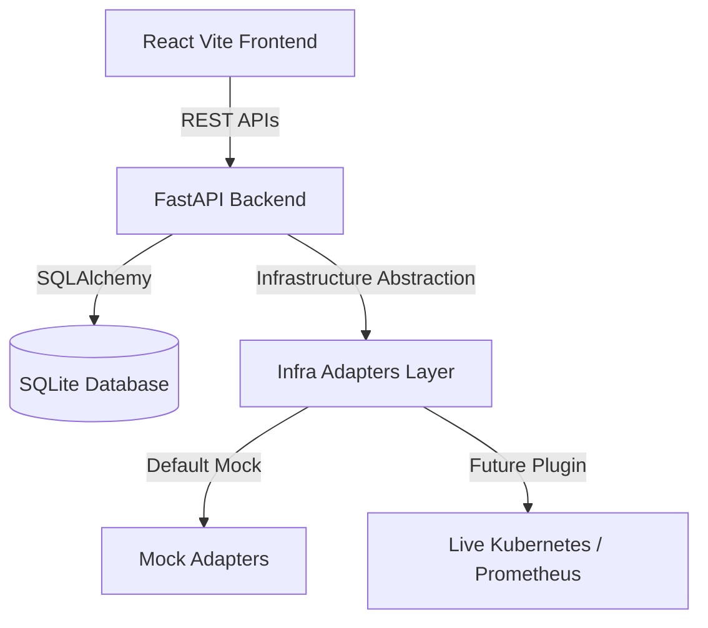

# Vector Walkthrough & Execution Guide

We have completed the implementation of Vector, the AI Decision Intelligence & Assurance Platform for Autonomous Infrastructure. 

Below is a summary of the architectural changes and instructions to run the platform locally.

---

## What Was Built

We implemented a full-stack, modular architecture with a pluggable adapter framework to allow easy K8s/Prometheus integrations later:



### Component Breakdown
1. **Infrastructure Abstraction Adapter Layer (`infra_adapters.py`)**: Defines strict interfaces (`BaseKubernetesAdapter` and `BaseMetricsAdapter`) allowing developers to toggle between `mock` and `live` modes via environment variables (`INFRA_MODE=mock` or `live`).
2. **FastAPI Services**:
   - **`metrics_service.py`**: A background telemetry loop driving dynamic fluctuations and incident patterns.
   - **`prediction_service.py`**: Translates telemetry spikes into linear forecasts and risk alerts.
   - **`candidate_generator.py`**: Maps forecast threats to candidate remediation items.
   - **`assurance_service.py`**: Scores proposed actions using a 5-dimensional evaluation algorithm.
   - **`execution_service.py`**: Invokes the active Kubernetes adapter to scale/restart workloads and recovers metrics.
3. **Cockpit UI**:
   - **Mission Control Dashboard**: Displays real-time charts (Recharts) and cluster health.
   - **Incident Simulator**: Form panel to start/stop failure states.
   - **Decision Center**: Core USP cockpit showing Decision scores, Digital Twin before/after values, and approvals.
   - **Policy Center**: Settings console to edit limits and rules.
   - **Audit Timeline**: Chronological list of all incident actions.

---

## Running the Platform

Ensure you have two terminals open in the workspace directory.

### 1. Launch the Backend Server
Install required Python dependencies:
```bash
pip install fastapi uvicorn sqlalchemy pytest
```
Start the FastAPI server:
```bash
python -m uvicorn backend.main:app --host 0.0.0.0 --port 8000 --reload
```
The API docs will be available at `http://localhost:8000/docs`.

### 2. Launch the Frontend Dev Server
Navigate to the `frontend` folder, install npm dependencies, and run Vite:
```bash
cd frontend
npm install
npm run dev
```
Open `http://localhost:5173` in your browser.

---

## 🌐 Infrastructure Digital Twin Simulation Enhancements

The Digital Twin (`/digital-twin`) has been upgraded into a comprehensive **What-If Simulation Studio**:

1. **Full Microservice Topologies**:
   - **Inventra ERP**: Complete 4-tier architecture (`erp-frontend` -> `erp-core`, `erp-frontend` -> `erp-inventory`, `erp-core` & `erp-inventory` -> `erp-db`) with live telemetry indicators (CPU%, Mem%, Latency, Replicas).
   - **ApexStore E-Commerce & Standard Demo**: Full multi-tier service graphs with animated SVG traffic packet streams.
2. **Interactive What-If Simulation Studio**:
   - **Capacity Scaling Simulation**: Uses the Proportional State-Space Projection Model ($U_{proj} = U_{curr} \times \frac{R_{curr}}{R_{target}}$) to project CPU drops, latency reduction, and hourly cost deltas.
   - **Chaos & Failure Blast Radius**: Injects simulated faults (`CPU_SPIKE`, `MEMORY_LEAK`, `TRAFFIC_SURGE`, `DATABASE_DEADLOCK`) and maps downstream cascade probabilities across dependent nodes.
   - **Traffic Shock Modeling**: Tests 1.5x–5x load shocks to measure cluster headroom.
   - **5D Decision Assurance**: Computes Decision Confidence, Operational Risk Index, Policy Compliance, Twin Stability, and Rollback Feasibility with unified trust scores ($0-100$).
   - **Direct Cluster Execution**: Single-click "Apply Validated Action to Cluster" dispatch with timeline audit logging.

---

## ⏱️ Chronological Incident Journey & Timeline Overhaul

The Decision Timeline (`/timeline`) was completely reorganized from a flat list into a high-fidelity incident cockpit:

1. **Incident Journey Hero & 5-Stage Stepper**:
   - Every incident features an interactive visual stepper: `[1] Detection` ➔ `[2] Forecasting` ➔ `[3] Decision Assurance` ➔ `[4] Remediation` ➔ `[5] Resolved`.
   - Real-time status badges, duration calculation, and automated phase tracking.
2. **Telemetry Deduplication & Forecast Stream Accordion**:
   - High-frequency background predictions are intelligently grouped into collapsible forecast streams with a 1-click toggle, preventing clutter while preserving raw audit events.
3. **Forensic Search & Filter Navigator**:
   - Instant search by service name or incident ID, and status filtering (`All`, `Active`, `Resolved`).
4. **Rich Timeline Pins & Forensic Drawers**:
   - Color-coded node pins (`Detection`, `Forecast`, `Decision`, `Action`, `Resolved`) with `T+00:00` relative timestamps, metric delta pills, and expandable raw JSON inspection drawers.

---

## 🔌 Inventra ERP Real Client Integration & Telemetry Agent

Vector now seamlessly connects with real client deployments (Inventra ERP) via an end-to-end telemetry ingestion pipeline:

1. **Standalone Client Agent ([`vector_agent.py`](file:///c:/Users/sathi/Downloads/VectorAI-main/VectorAI-main/vector_agent.py))**:
   - Native OS and hardware telemetry probing using `psutil` with automatic fallback to organic microservice models.
   - Pushes batch telemetry to `POST /api/ingest/batch` with `X-Vector-Key: vect_inventraerp_sk_live_abc123xyz`.
   - Built-in stress test command: `python vector_agent.py --spike erp-frontend` to demonstrate SRE OLS slope forecasting and assurance scoring in real-time.
2. **Dynamic Ingestion Handover & API ([`backend/api/ingest_router.py`](file:///c:/Users/sathi/Downloads/VectorAI-main/VectorAI-main/backend/api/ingest_router.py))**:
   - Tracks live client telemetry timestamps in `LAST_LIVE_INGEST`.
   - `GET /api/ingest/status`: Reports live streaming status and connected microservices.
   - `metrics_service.py` automatically pauses synthetic jitter when real agent data arrives, ensuring pure client telemetry drives the system.
3. **Client Integration Modal & Status in Cockpit ([`frontend/src/pages/Dashboard.jsx`](file:///c:/Users/sathi/Downloads/VectorAI-main/VectorAI-main/frontend/src/pages/Dashboard.jsx))**:
   - Displays real-time `LIVE AGENT STREAMING` / `AGENT READY (SYNTHETIC STANDBY)` pill.
   - One-click slideout modal with API keys, setup commands, and quick copy triggers.

---

## 🧪 Verifying Code Correctness

1. **Backend Unit Tests**:
   ```bash
   python -m pytest backend/tests/ -v
   ```
   *Result: 3/3 passed (100%).*

2. **Full End-to-End System Feature Verification**:
   ```bash
   python test_all_features.py
   ```
   *Result: All 4 core features verified and passing 100% (Architecture health check, OLS prediction, Telegram instant push, and Telegram interactive approval buttons).*

3. **Frontend Code Quality & Lint**:
   ```bash
   npm run lint
   ```
   *Result: 0 errors.*
